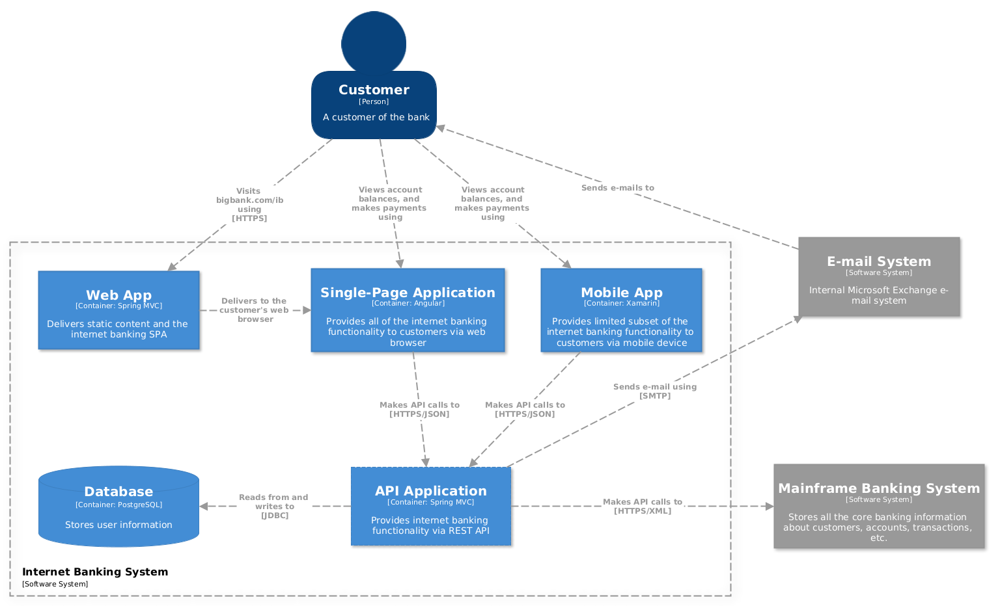

# C4 Model Shapes for yEd

The [C4 Model](https://c4model.com/) provides simple abstractions for documenting and communicating software architectures visually.

Here you can find a palette with shapes/nodes for the [yEd Graph Editor](https://www.yworks.com/products/yed) to create diagrams with the C4 Model.

# Import

Go to `Edit > Manage Palettes ...` and then click `Import Section` to select the `C4 Model.graphml` file. 

You should find the `C4 Model` in the list of available palette sections.

# Example

Level 2: Container Diagram ([original](https://c4model.com/img/bigbankplc-Containers.png))

